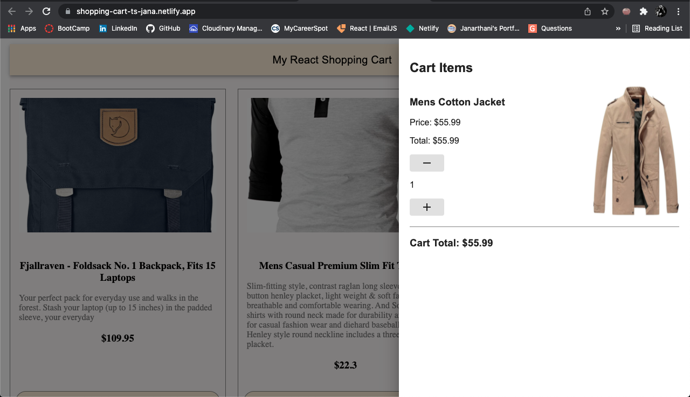

# Shopping Cart  [](https://opensource.org/licenses/MIT)
## Description
This is a shopping cart like app created using creat react app and typescript. You can add available products to your cart. In the cart items the quantity of the selected products can be increased or decreased. 

## Built Using
* TypeScript
* React
* Material-UI
* Styled Components
* FakeStoreApi

## Table of Contents
* [Installation](#Installation)
* [Usage](#Usage)
* [License](#License)
* [Contributing](#Contributing)
* [Screenshot](#Screenshot)
* [Deployed](#Deployed)
* [Questions](#Questions)

### Installation
To clone the repo run ```git clone git@github.com:vsjanarthani/Shopping_Cart.git ``` in your terminal. After cloning the repo, run ```npm install``` to install the necessary dependencies.

### Usage
After installing all the dependencies, run ```npm start``` in your terminal to start the application. 
 
### License
This application is covered under **MIT** license.

### Contributing 
No contributions at the moment.

### Screenshot


### Deployed
The application is deployed on  [https://shopping-cart-ts-jana.netlify.app/](https://shopping-cart-ts-jana.netlify.app/)
<!-- Netlify deploy setting - change the build command to "CI=false npm run build"-->

### Questions
If you have any questions, please reach out to the<br>
Author: Janarthani V S <br>
Email : <vs.janarthani@gmail.com> <br>
Author's github profile: [GitHub](https://github.com/vsjanarthani)